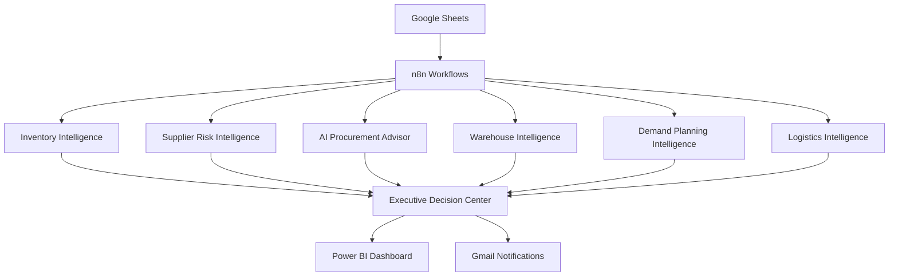
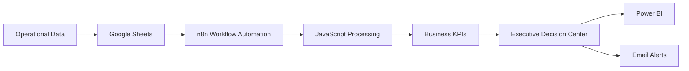
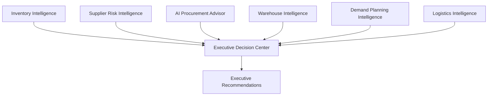

# Architecture

This folder contains the system architecture diagrams, workflow diagrams, and solution architecture for the AI Supply Chain Control Tower.
# Architecture

## Overview

This folder contains the architecture diagrams for the AI Supply Chain Control Tower.

The solution demonstrates how workflow automation, business intelligence, and executive decision support can be integrated into a unified supply chain platform.

## Components

- Google Sheets
- n8n Workflows
- JavaScript
- Executive Decision Center
- Power BI
- Gmail Notifications

## Architecture Diagrams

- System Architecture
- Data Flow
- Workflow Architecture
# System Architecture

# Data Flow

# Workflow Architecture

